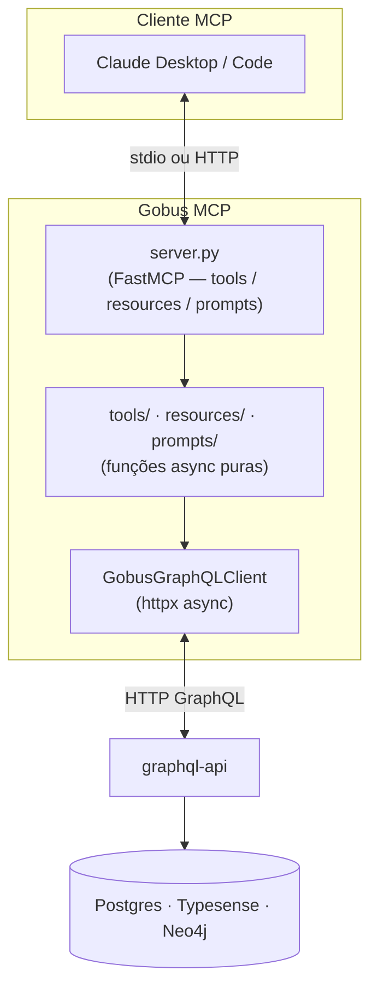

# Arquitetura

## Visão geral

O Gobus MCP é um servidor [FastMCP](https://github.com/jlowin/fastmcp) fino. O `server.py` é o único entrypoint: registra as 7 tools, 3 resources e 4 prompts, e mantém um cliente GraphQL singleton (`_client`) que toda chamada reutiliza.



Camadas:

- **`server.py`** — registro de tools/resources/prompts e o singleton `_client`.
- **`config.py`** — `Settings` (pydantic-settings, prefixo `GOBUS_`), lido no import.
- **`client.py`** — `GobusGraphQLClient`, wrapper httpx que executa queries e lança `GobusGraphQLError` quando a resposta traz `errors[]`.
- **`tools/` · `resources/` · `prompts/`** — a lógica de cada capacidade, isolada do framework.

## Transport

O transport é escolhido em runtime conforme a variável `PORT`:

| Condição | Transport | Uso |
|----------|-----------|-----|
| `PORT` ausente | `stdio` | Claude Desktop / Code local — o cliente sobe o processo e fala via stdin/stdout |
| `PORT` presente (Cloud Run injeta `8080`) | `http` (streamable-http stateless) | Produção em Cloud Run, escutando em `0.0.0.0:PORT` |

### Por que não SSE

SSE **não** é usado em Cloud Run. Com múltiplas instâncias, o transport SSE sofre uma _race condition_ de inicialização: a sessão estabelecida em uma instância pode receber eventos roteados para outra. O transport HTTP streamable em modo _stateless_ não mantém estado de sessão entre requisições, então funciona corretamente atrás do balanceador do Cloud Run com qualquer número de instâncias.

## GraphQL-only

Toda leitura de dados passa pela `graphql-api` via HTTP GraphQL (httpx async). O servidor **não** abre conexões diretas a Postgres, Typesense ou Neo4j. Benefícios:

- **Rate-limiting centralizado** — uma única fronteira controla a carga sobre os bancos.
- **Autenticação** — credenciais e políticas vivem na `graphql-api`, não espalhadas pelo MCP.
- **Analytics** — todo acesso é observável em um só lugar.
- **Validação de schema** — o contrato GraphQL é a fonte da verdade; o MCP não precisa conhecer o layout físico das tabelas.

O `GobusGraphQLClient` é deliberadamente fino: monta o payload `{query, variables}`, injeta o header `X-API-Key` quando há chave, faz POST, e converte `errors[]` em exceção. Sem cache, sem retry, sem lógica de negócio.

## Padrão tool/server

Cada tool é uma **função async pura** em `tools/<nome>.py` que recebe um `GobusGraphQLClient` como argumento. O `server.py` apenas adapta a assinatura MCP e delega:

```python
# server.py
@mcp.tool()
async def gobus_search_news(query: str, agency_key: str = "", page: int = 1, limit: int = 10) -> str:
    """Busca notícias no portal Gov.BR por texto livre e/ou agência."""
    return await search_news(query, _client, agency_key or None, page, limit)
```

```python
# tools/search_news.py
async def search_news(query, client, agency_key=None, page=1, limit=10) -> str:
    data = await client.execute(_SEARCH_QUERY, {...})
    return _format_markdown(data)
```

Essa separação permite testar a lógica de cada tool isoladamente com um `FakeGraphQLClient` (em `tests/conftest.py`, com `execute = AsyncMock`), sem nenhuma chamada de rede:

```python
async def test_exemplo(fake_client):
    fake_client.set_response({"search": {"articles": [...], "found": 1, "page": 1}})
    result = await search_news("tema", fake_client)
    assert "título" in result
```

As tools retornam **Markdown formatado**, não JSON — são consumidas diretamente pelo LLM.

## Schema drift

As queries GraphQL ficam embutidas como strings nas funções de tool (`_SEARCH_QUERY`, `_ANALYTICS_QUERY`, etc.). O principal risco operacional é o **schema drift**: se a `graphql-api` renomear um campo, argumento ou tipo, a query quebra em runtime — não há checagem em tempo de compilação.

Gotchas conhecidos do schema atual:

| Campo / Argumento | Errado | Correto |
|-------------------|--------|---------|
| Enum de tipo de entidade | `EntityType` | `EntityKind` |
| Argumento de `relatedEntities` e `entityNetwork` | `entityId:` | `id:` |
| Campo em `RelatedEntity` | `entityId` | `canonicalId` |
| Campos de `Agency` | `key`, `name` | `code`, `label` |
| Datas em `agencyAnalytics` / `entityCoverage` | strings ISO | `datetime.date` no lado da graphql-api (asyncpg rejeita strings) |
| Filtro de agência em `search()` | argumento direto | `filter: {agencies: [...]}` |
| Score de tendência do Article | campo no root | `features { trendingScore }` |

!!! warning "Mantenha as queries alinhadas ao SDL"
    Ao alterar uma query, confira o SDL atual da `graphql-api`. Como o drift só aparece em runtime, os testes com `FakeGraphQLClient` **não** detectam incompatibilidade de schema — apenas a integração real detecta.
