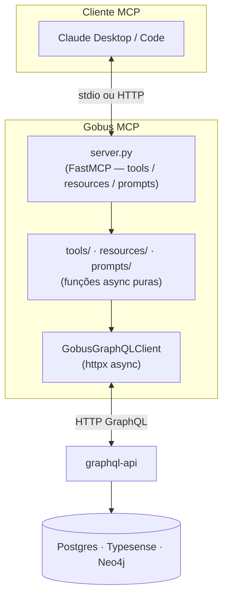

# Arquitetura

## Visão geral

O Gobus MCP é um servidor [FastMCP](https://github.com/jlowin/fastmcp) fino. O `server.py` é o único entrypoint: registra as 13 tools (4 delas abrem MCP Apps), 10 resources (4 deles `ui://`) e 4 prompts e mantém um contêiner de dependências (`Deps`: cliente GraphQL, catálogo de agências, snapshot de atividade das agências e o cache das tools de anomalia e forecast) que toda chamada lê via `get_deps()`.


```mermaid
flowchart TB
    subgraph cliente["Cliente MCP"]
        Claude["Claude Desktop / Code"]
    end

    subgraph gobus["Gobus MCP"]
        Server["server.py<br/>(FastMCP — tools / resources / prompts)"]
        Client["GobusGraphQLClient<br/>(httpx async)"]
        Tools["tools/ · resources/ · prompts/<br/>(funções async puras)"]
        Server --> Tools
        Tools --> Client
    end

    API["graphql-api"]
    Stores[("Postgres · Typesense · Neo4j")]

    Claude <-->|stdio ou HTTP| Server
    Client <-->|HTTP GraphQL| API
    API --> Stores
```

Camadas:

- **`server.py`** — registro de tools/resources/prompts e o contêiner `Deps(client, catalog, activity, cache)` com `get_deps()`. Toda tool é registrada com `output_schema=None` e `annotations={"readOnlyHint": True}`.
- **`config.py`** — `Settings` (pydantic-settings, prefixo `GOBUS_`), lido no import.
- **`client.py`** — `GobusGraphQLClient`, wrapper httpx que executa queries e lança `GobusGraphQLError` quando a resposta traz `errors[]`.
- **`tools/` · `resources/` · `prompts/`** — a lógica de cada capacidade, isolada do framework.

Fundações compartilhadas (Fase 2.5):

| Módulo | Papel |
|--------|-------|
| `cache.py` | `TTLCache` assíncrono com single-flight por chave e relógio injetável |
| `agency_catalog.py` | `AgencyCatalog`: códigos, nomes humanos (via `agencyAnalytics` de D−1), republicadoras, validação com aliases curados (`ms`→`saude`) antes do `difflib`, agências ativas (`topAgencies`). Cache de 24 h |
| `calendario.py` | fuso BRT, defeso eleitoral 2026 (04/07–25/10) e recuperação até 29/11, feriados, janelas fechadas `[D−N, D−1]` e baseline. O nome evita sombrear o `calendar` da stdlib |
| `readability.py` | escala do Flesch (`flesch_en_textstat`), clamp em 0–100, faixas únicas 0/25/50/75, médias ponderadas que ignoram nulo, janela efetiva |
| `readability_data.py` | leitura de legibilidade por agência: janela pedida, histórico e janela efetiva |
| `data_status.py` | avaliadores de saúde das fontes (`ok \| degraded \| unavailable`), detecção dinâmica e mapeamento para avisos |
| `payloads/` | modelos pydantic dos relatórios estruturados (`common`, `readability`, `scorecard`, `anomalies`, `forecast`), o `structuredContent` dos MCP Apps; `compact_anomaly_payload` e `compact_forecast_payload` deixam no payload só o que o app desenha |
| `agency_activity.py` | snapshot `agencyAnalytics` DAY das 156 agências (cache de 6 h): agências silenciadas e retomadas, volume diário da plataforma |
| `domains.py` | os 7 domínios de `policies.domain` mais `OTHER`, aliases em português, mapas curados de tema e de agência |
| `theme_data.py` | contagens de temas por range móvel (`topThemes` + `analyticsKpis`), cache de 5 min |
| `ui/` | MCP Apps: `render_app` (HTML único, estático, com guards de CSP e XSS), `app_tool_kwargs`, `register_ui_resources`, `app_result` e os assets (`_bridge.js` JSON-RPC raw, `_dom.js`, `_svg.js`, `_tokens.css` e o JS/CSS de cada app); `ui/preview.py` com as tools `gobus_dev_preview_*` (só com `GOBUS_DEV_PREVIEW=1`). Ver [MCP Apps](apps/index.md) |
| `analytics/` | funções puras: razões (Laplace, share-of-voice, taxa log por dia, severidade), perfil de dia útil e feriados, temas, entidades, forecast e o Markdown de anomalias e forecast |

## Transport

O transport é escolhido em runtime conforme a variável `PORT`:

| Condição | Transport | Uso |
|----------|-----------|-----|
| `PORT` ausente | `stdio` | Claude Desktop / Code local — o cliente sobe o processo e fala via stdin/stdout |
| `PORT` presente (Cloud Run injeta `8080`) | HTTP stateless em `/mcp` + compat `/sse` | Produção em Cloud Run, escutando em `0.0.0.0:PORT` |

### HTTP stateless `/mcp` + compat `/sse`

- **`/mcp`** (Streamable HTTP, spec 2025-03-26) é o endpoint primário, em modo _stateless_: nenhuma sessão fica em memória entre requisições, então funciona atrás do balanceador do Cloud Run com qualquer número de instâncias.
- **`/sse` + `/messages/`** (spec 2024-11-05) ficam por compatibilidade com clientes antigos. A sessão SSE vive na instância que a abriu; por isso, com mais de uma instância, prefira `/mcp`. O `server.py` monta essas rotas com API privada do fastmcp (`_mcp_server`, `_additional_http_routes`), por isso o `fastmcp` está fixado em `<3.5` e o smoke do Docker testa as três rotas.

## GraphQL-only

Toda leitura de dados passa pela `graphql-api` via HTTP GraphQL (httpx async). O servidor **não** abre conexões diretas a Postgres, Typesense ou Neo4j. Benefícios:

- **Rate-limiting centralizado** — uma única fronteira controla a carga sobre os bancos.
- **Autenticação** — credenciais e políticas vivem na `graphql-api`, não espalhadas pelo MCP.
- **Analytics** — todo acesso é observável em um só lugar.
- **Validação de schema** — o contrato GraphQL é a fonte da verdade; o MCP não precisa conhecer o layout físico das tabelas.

O `GobusGraphQLClient` é deliberadamente fino: monta o payload `{query, variables}`, injeta o header `X-API-Key` quando há chave, faz POST, e converte `errors[]` em exceção. Sem retry e sem lógica de negócio; o cache (catálogo de agências) fica em `cache.py`.

Todas as queries são **somente leitura e nomeadas** (`query NomeDaOperacao …`). Um teste de contrato valida toda constante `*_QUERY` contra um snapshot do SDL obtido por introspecção (`tests/fixtures/schema.graphql`).

## Padrão tool/server

Cada tool é uma **função async pura** em `tools/<nome>.py` que recebe um `GobusGraphQLClient` (e, quando precisa, o `AgencyCatalog`) como argumento. O `server.py` apenas adapta a assinatura MCP e delega:

```python
# server.py
@mcp.tool(output_schema=None, annotations={"readOnlyHint": True})
async def gobus_get_agency_summary(agency_key: str, days: int = 30) -> str:
    """Resumo executivo de uma agência…"""
    deps = get_deps()
    return await get_agency_summary(agency_key, deps.client, days, catalog=deps.catalog)
```

`output_schema=None` faz o cliente receber o Markdown cru no `content` (sem o `{"result": "…"}` que o fastmcp 3.4 gera para tools `-> str`). As tools de MCP App separam `build_*_payload` (I/O, devolve o modelo pydantic) de `render_*_markdown` (puro) e são registradas com `app_tool_kwargs`, devolvendo `ToolResult` (o `-> ToolResult` também suprime o `outputSchema`):

```python
@mcp.tool(**app_tool_kwargs("article_scorecard"))  # app, meta ui/resourceUri, readOnlyHint
async def gobus_score_article(unique_id: str, compare_with: str = "") -> ToolResult:
    report = await build_score_payload(get_deps().client, unique_id, compare_with=compare_with or None)
    return app_result(report)  # content = Markdown; structuredContent = payload (summary primeiro, ≤ 6 KB)
```

```python
# tools/search_news.py
async def search_news(query, client, agency_key=None, page=1, limit=10) -> str:
    data = await client.execute(_SEARCH_QUERY, {...})
    return _format_markdown(data)
```

Essa separação permite testar a lógica de cada tool isoladamente com um `FakeGraphQLClient` (em `tests/conftest.py`), sem nenhuma chamada de rede. Nos testes novos, as respostas são roteadas pelo nome da operação GraphQL:

```python
async def test_exemplo(fake_client):
    route_catalog(fake_client)  # CatalogAgencies / CatalogAgencyNames / CatalogTopAgencies
    fake_client.route("AgencySummaryAnalytics", {"agencyAnalytics": [...]})
    result = await get_agency_summary("saude", fake_client, today=date(2026, 10, 5))
    assert fake_client.calls("AgencySummaryAnalytics")[0]["agencies"] == ["saude"]
```

As tools retornam **Markdown formatado**, não JSON — são consumidas diretamente pelo LLM. A exceção são as tools de MCP App, que somam ao Markdown (completo no `content`) o payload do painel, com o mesmo Markdown até 6 KB em `summary`. Nos radares, `build_anomaly_output`/`build_forecast_output` devolvem `(payload, Markdown completo)` e a tool chama `app_result(report, content=markdown)`. Datas de referência (`today`/`now`) são injetáveis.

## Schema drift

As queries GraphQL ficam embutidas como strings nas funções de tool (`_SEARCH_QUERY`, `_ANALYTICS_QUERY`, etc.). O principal risco operacional é o **schema drift**: se a `graphql-api` renomear um campo, argumento ou tipo, a query quebra em runtime — não há checagem em tempo de compilação.

Gotchas conhecidos do schema atual:

| Campo / Argumento | Errado | Correto |
|-------------------|--------|---------|
| Enum de tipo de entidade | `EntityType` | `EntityKind` |
| Argumento de `relatedEntities` e `entityNetwork` | `entityId:` | `id:` |
| Campo em `RelatedEntity` | `entityId` | `canonicalId` |
| Campos de `Agency` | `key`, `name` | `code`, `label` |
| Datas em `agencyAnalytics` / `entityCoverage` | strings ISO | `datetime.date` no lado da graphql-api (asyncpg rejeita strings) |
| Filtro de agência em `search()` | argumento direto | `filter: {agencies: [...]}` |
| Score de tendência do Article | campo no root | `features { trendingScore }` |
| Média do baseline em `trendingThemes` | `baseDailyAvg`, `baselineCount` | `baselineDailyAvg` (o baseline **inclui** a janela) |
| Limite em `search()` | `limit:` | `search` não tem `limit`; use `articles(page, limit ≤ 250, filter, sort)` |
| `themeCode` em `trendingThemes` | — | sempre `null`; use `themeLabel` |
| `agencies { label }` | nome humano | `label == code`; o nome vem de `agencyAnalytics.agencyName` (catálogo) |
| `endDate` / `dateTo` | — | `articles.filter.endDate` e `entityCoverage.dateTo` são exclusivos; `agencyAnalytics.dateTo` é inclusivo em `DAY` e exclusivo na prática em `MONTH`/`WEEK` (00:00 do dia; use `calendario.agency_analytics_bounds`); dias da API em UTC |

!!! warning "Mantenha as queries alinhadas ao SDL"
    O teste de contrato (`tests/test_graphql_contract.py`) valida as queries contra o snapshot do SDL. Para atualizar o snapshot depois de mudanças na `graphql-api`: `python tests/fixtures/refresh_schema.py` (introspecção, só leitura). A variante `pytest -m live` compara o snapshot com a API de produção.
