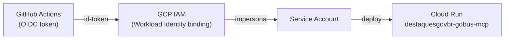

# Deploy & Config

## Variáveis de ambiente

Todas as configurações usam o prefixo `GOBUS_` e são lidas por `Settings` (pydantic-settings) **no import** — não são lazy. Em desenvolvimento, copie `.env.example` → `.env`.

| Variável | Default | Descrição |
|----------|---------|-----------|
| `GOBUS_GRAPHQL_URL` | `http://localhost:8000/graphql` | Endpoint da `graphql-api` |
| `GOBUS_GRAPHQL_API_KEY` | `""` | Chave de API (opcional, enviada como header `X-API-Key`) |
| `GOBUS_REQUEST_TIMEOUT` | `10.0` | Timeout do httpx, em segundos |
| `GOBUS_LOG_LEVEL` | `INFO` | Nível de log |

Além dessas, o servidor lê `PORT` (injetada pelo Cloud Run) para decidir o transport — veja [Arquitetura → Transport](arquitetura.md#transport).

## Cloud Run

**Serviço:** `destaquesgovbr-gobus-mcp`
**Produção:** `https://destaquesgovbr-gobus-mcp-klvx64dufq-rj.a.run.app`
**Projeto GCP:** `inspire-7-finep`

### CI/CD

O deploy é automático. Um push em `main` que altere qualquer um destes caminhos dispara o workflow `.github/workflows/deploy.yaml`:

- `src/gobus_mcp/**`
- `Dockerfile`
- `pyproject.toml`
- `.github/workflows/deploy.yaml`

O workflow reutiliza `destaquesgovbr/reusable-workflows/.github/workflows/cloud-run-deploy.yml@v2`, que builda a imagem Docker, publica no Artifact Registry (`destaquesgovbr-gobus-mcp`) e faz deploy no serviço Cloud Run. Também pode ser disparado manualmente via `workflow_dispatch`.

!!! note "Env vars são geridas pelo Terraform"
    O CI atualiza apenas a **imagem** do serviço. As variáveis de ambiente do Cloud Run (incluindo `GOBUS_GRAPHQL_URL`) são geridas via Terraform no repo `infra/` — não pelo workflow de deploy.

### Dockerfile

```dockerfile
FROM python:3.12-slim AS base
WORKDIR /app
COPY pyproject.toml ./
COPY src/ ./src/
RUN pip install --no-cache-dir .
ENV PYTHONPATH=/app/src
EXPOSE 8080
CMD ["python", "-m", "gobus_mcp"]
```

Como o Cloud Run injeta `PORT=8080`, o container sobe automaticamente em transport HTTP.

## WIF (Workload Identity Federation)

A autenticação do CI com o GCP não usa chaves de service account de longa duração. Em vez disso, o GitHub Actions emite um token OIDC que o GCP IAM aceita via Workload Identity Federation:



O binding IAM que autoriza o repositório `destaquesgovbr/gobus-mcp` foi provisionado na infra (PR #207). O workflow declara `permissions: id-token: write` para poder solicitar o token OIDC.

## Desenvolvimento local

Aponte o servidor local para a `graphql-api` que preferir via `GOBUS_GRAPHQL_URL`:

```bash
# Contra uma graphql-api local
GOBUS_GRAPHQL_URL=http://localhost:8000/graphql python -m gobus_mcp

# Contra a graphql-api de produção (dados reais)
GOBUS_GRAPHQL_URL=https://destaquesgovbr-graphql-api-klvx64dufq-rj.a.run.app/graphql python -m gobus_mcp
```

Sem `PORT`, o servidor sobe em stdio — pronto para Claude Desktop/Code. Veja [Início Rápido](quickstart.md#3-rodar-localmente) para a config do `.mcp.json`.

## Comandos úteis

```bash
# Documentação (MkDocs)
make docs-serve      # serve em http://localhost:8001
make docs-build      # build em modo --strict

# Testes
pytest                                          # todos
pytest tests/test_tools/test_search_news.py     # um arquivo
pytest -k test_retorna_artigos                  # por nome

# Lint e formatação
ruff check src/ tests/
ruff format src/ tests/
```
