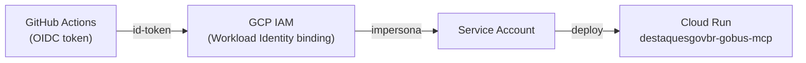

# Deploy & Config

## Variáveis de ambiente

Todas as configurações usam o prefixo `GOBUS_` e são lidas por `Settings` (pydantic-settings) **no import** — não são lazy. Em desenvolvimento, copie `.env.example` → `.env`.

| Variável | Default | Descrição |
|----------|---------|-----------|
| `GOBUS_GRAPHQL_URL` | `http://localhost:8000/graphql` | Endpoint da `graphql-api` |
| `GOBUS_GRAPHQL_API_KEY` | `""` | Chave de API (opcional, enviada como header `X-API-Key`) |
| `GOBUS_REQUEST_TIMEOUT` | `10.0` | Timeout do httpx, em segundos |
| `GOBUS_LOG_LEVEL` | `INFO` | Nível de log |

Além dessas, o servidor lê `PORT` (injetada pelo Cloud Run) para decidir o transport — veja [Arquitetura → Transport](arquitetura.md#transport).

## Cloud Run

**Serviço:** `destaquesgovbr-gobus-mcp`
**Produção:** `https://destaquesgovbr-gobus-mcp-klvx64dufq-rj.a.run.app`
**Projeto GCP:** `inspire-7-finep`

### Transport em produção: HTTP stateless `/mcp` + compat `/sse`

O Cloud Run injeta `PORT=8080`, então o container sobe em **HTTP stateless** (veja [Arquitetura → Transport](arquitetura.md#transport)):

| Endpoint | Spec | Uso |
|----------|------|-----|
| `/mcp` | Streamable HTTP 2025-03-26, stateless | Primário: Claude Desktop (conector), claude.ai e clientes atuais |
| `/sse` + `/messages/` | SSE 2024-11-05 | Compatibilidade com clientes antigos; a sessão vive na instância que a abriu |

### CI/CD

**Testes (`.github/workflows/test.yaml`)** — roda em `pull_request`, `workflow_dispatch` e como `workflow_call` do deploy:

1. `poetry check --lock` (Poetry 2.0.1);
2. `poetry install --with dev`;
3. `ruff check src tests` e `ruff format --check src tests`;
4. `pytest -q` (os marcadores `live` e `ui` ficam fora por padrão);
5. `mkdocs build --strict`.

**Deploy (`.github/workflows/deploy.yaml`)** — um push em `main` que altere qualquer um destes caminhos dispara o workflow:

- `src/gobus_mcp/**`
- `Dockerfile`
- `pyproject.toml`
- `poetry.lock`
- `.github/workflows/deploy.yaml`
- `.github/workflows/test.yaml`

O job `ci` chama o `test.yaml`; o job `deploy` tem `needs: ci` e reutiliza `destaquesgovbr/reusable-workflows/.github/workflows/cloud-run-deploy.yml@v2`, que builda a imagem Docker, publica no Artifact Registry (`destaquesgovbr-gobus-mcp`) e faz deploy no serviço Cloud Run. Também pode ser disparado manualmente via `workflow_dispatch`.

!!! note "Env vars são geridas pelo Terraform"
    O CI atualiza apenas a **imagem** do serviço. As variáveis de ambiente do Cloud Run (incluindo `GOBUS_GRAPHQL_URL`) são geridas via Terraform no repo `infra/` — não pelo workflow de deploy.

### Dockerfile (build a partir do lock)

```dockerfile
# Etapa 1 (builder): Poetry cria /app/.venv só com o grupo main, sem o pacote raiz.
FROM python:3.12-slim AS builder
ENV POETRY_VERSION=2.0.1 POETRY_NO_INTERACTION=1 \
    POETRY_VIRTUALENVS_IN_PROJECT=true POETRY_VIRTUALENVS_CREATE=true
RUN pip install "poetry==${POETRY_VERSION}"
WORKDIR /app
COPY pyproject.toml poetry.lock ./
RUN poetry check --lock && poetry install --only main --no-root --no-ansi

# Etapa 2 (runtime): só a venv e o código-fonte.
FROM python:3.12-slim
WORKDIR /app
COPY --from=builder /app/.venv /app/.venv
COPY src/ ./src/
ENV PATH="/app/.venv/bin:${PATH}" PYTHONPATH=/app/src PYTHONUNBUFFERED=1
EXPOSE 8080
CMD ["python", "-m", "gobus_mcp"]
```

O build falha se o `poetry.lock` estiver dessincronizado do `pyproject.toml`. O `fastmcp` está fixado em `>=3.4.2,<3.5` porque o `/sse` usa API privada do fastmcp.

**Smoke local da imagem** (as três rotas):

```bash
docker build -t gobus-mcp:local .
docker run --rm -p 8080:8080 -e PORT=8080 \
  -e GOBUS_GRAPHQL_URL=https://destaquesgovbr-graphql-api-klvx64dufq-rj.a.run.app/graphql \
  gobus-mcp:local
# /mcp: initialize (POST JSON-RPC) · /sse: devolve o endpoint de mensagens · /messages/: POST da sessão
```

## WIF (Workload Identity Federation)

A autenticação do CI com o GCP não usa chaves de service account de longa duração. Em vez disso, o GitHub Actions emite um token OIDC que o GCP IAM aceita via Workload Identity Federation:


```mermaid
flowchart LR
    GH["GitHub Actions<br/>(OIDC token)"]
    WIF["GCP IAM<br/>(Workload Identity binding)"]
    SA["Service Account"]
    CR["Cloud Run<br/>destaquesgovbr-gobus-mcp"]

    GH -->|id-token| WIF
    WIF -->|impersona| SA
    SA -->|deploy| CR
```

O binding IAM que autoriza o repositório `destaquesgovbr/gobus-mcp` foi provisionado na infra (PR #207). O workflow declara `permissions: id-token: write` para poder solicitar o token OIDC.

## Desenvolvimento local

Aponte o servidor local para a `graphql-api` que preferir via `GOBUS_GRAPHQL_URL`:

```bash
# Contra uma graphql-api local
GOBUS_GRAPHQL_URL=http://localhost:8000/graphql python -m gobus_mcp

# Contra a graphql-api de produção (dados reais)
GOBUS_GRAPHQL_URL=https://destaquesgovbr-graphql-api-klvx64dufq-rj.a.run.app/graphql python -m gobus_mcp
```

Sem `PORT`, o servidor sobe em stdio — pronto para Claude Desktop/Code. Veja [Início Rápido](quickstart.md) para a config do `.mcp.json`.

## Comandos úteis

```bash
# Documentação (MkDocs)
make docs-serve      # serve em http://localhost:8001
make docs-build      # build em modo --strict

# Testes (os marcadores live e ui ficam fora por padrão)
pytest                                          # todos
pytest tests/test_tools/test_search_news.py     # um arquivo
pytest -k test_retorna_artigos                  # por nome
pytest -m live                                  # contra a graphql-api de produção (só leitura)

# Lint e formatação
ruff check src/ tests/
ruff format src/ tests/

# Snapshot do SDL da graphql-api (introspecção, só leitura)
python tests/fixtures/refresh_schema.py
```
