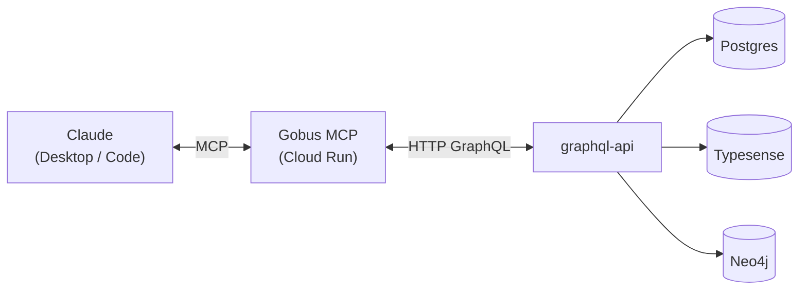

# Gobus MCP

O **Gobus MCP** é um servidor [Model Context Protocol](https://modelcontextprotocol.io) que expõe o acervo do **Destaques Gov.BR** — cerca de 300 mil artigos publicados por ~160 portais do gov.br, um grafo de entidades NER canonicalizadas e analytics de comunicação por agência — como _tools_, _resources_ e _prompts_ consumíveis diretamente por LLMs (Claude Desktop, Claude Code e qualquer cliente MCP).

Toda leitura de dados passa pela `graphql-api`: o servidor não abre conexões diretas a Postgres, Typesense ou Neo4j. Isso centraliza rate-limiting, autenticação, analytics e validação de schema em uma única fronteira.

## Como se encaixa

O cliente conversa com o Gobus MCP via protocolo MCP (stdio localmente, HTTP em produção). O Gobus MCP traduz cada chamada em uma query GraphQL e a `graphql-api` resolve contra os bancos de dados subjacentes.

## Capacidades

| Categoria | Quantidade | Exemplos |
|-----------|:----------:|----------|
| Tools     | 7 | `gobus_search_news`, `gobus_resolve_entity`, `gobus_get_entity_network`, `gobus_get_agency_analytics`, `gobus_detect_trends` |
| Resources | 3 | `gobus://agencies`, `gobus://themes`, `gobus://platform-stats` |
| Prompts   | 4 | `prompt_monitor_agency`, `prompt_trace_entity`, `prompt_weekly_digest`, `prompt_draft_press_release` |

As _tools_ retornam Markdown formatado (não JSON), pensado para ser lido diretamente pelo LLM.

## Por onde começar

- **[Início Rápido](quickstart.md)** — conecte ao servidor em produção ou rode localmente em poucos minutos.
- **[Referência de Tools](tools/index.md)** — argumentos, retornos e exemplos de cada tool.
- **[Arquitetura](arquitetura.md)** — transport, modelo GraphQL-only e padrões internos.
- **[Deploy & Config](deploy.md)** — variáveis de ambiente, Cloud Run e WIF.
